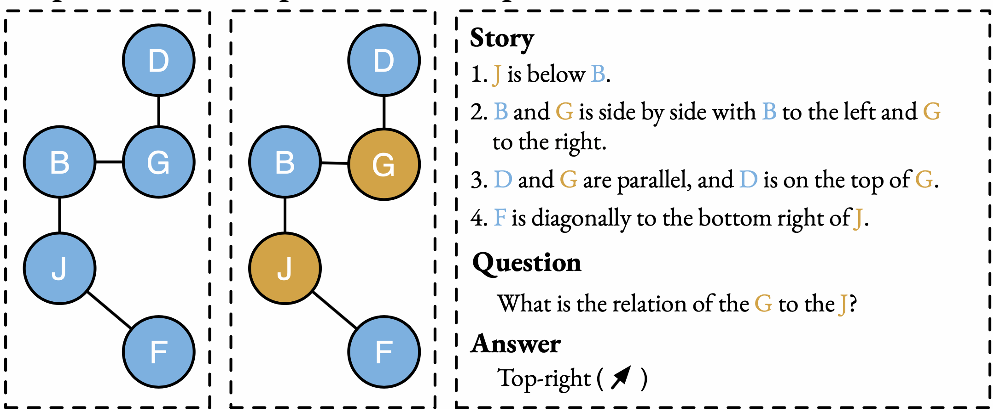

# StepGame: A New Benchmark for Robust Multi-Hop Spatial Reasoning in Texts

<p align="center">
  <a></a>
  <br />
</p>

## Quick Links
- [StepGame: A New Benchmark for Robust Multi-Hop Spatial Reasoning in Texts](#stepgame-a-new-benchmark-for-robust-multi-hop-spatial-reasoning-in-texts)
  - [Quick Links](#quick-links)
  - [Description](#description)
  - [Our Contributions](#our-contributions)
  - [StepGame Dataset](#stepgame-dataset)
    - [Version](#version)
    - [Generate more samples](#generate-more-samples)
  - [Bugs or questions?](#bugs-or-questions)
  - [Citation](#citation)

## Description
Here are the dataset and codes for the AAAI 2022 paper "[**StepGame: A New Benchmark for Robust Multi-Hop Spatial Reasoning in Texts**](https://ojs.aaai.org/index.php/AAAI/article/view/21383)".

## Our Contributions
* A new benchmark for multi-hop spatial reasoning in texts.
* A memory augmented neural network for multi-hop spatial reasoning.

## StepGame Dataset
### Version
We offer two variations of our StepGame dataset, both of which are identical in content except for the size of samples.
- `TrainVersion`: The "TrainVersion" is utilised in the baseline models presented in our paper. The models are trained on clean samples with varying levels of noise (k=1,2,3,4,5), where each value of k has 10,000 and 1,000 samples for training and validation, respectively. Thus, the total number of training samples is 50,000. During the testing phase, noise samples with k=1,2,3,4,5,6,7,8,9,10 are used. All of these samples are consolidated in the "[TrainVersion](Dataset/TrainVersion)" folder.

- `CompleteVersion`: The "CompleteVersion" is an extension of the "TrainVersion" that we have provided to enable future research on spatial reasoning over texts. This extended version includes more samples and contains both clean and noise data. In this version, each part (clean and noise) consists of 30,000, 1,000, and 30,000 samples for training, validation, and testing, respectively, for values of k ranging from 1 to 10. All of these samples are consolidated in the "[CompleteVersion](Dataset/CompleteVersion)" folder.

### Generate more samples
You can produce additional samples by executing the following command:
```
python parameterized_step_game_8relation.py --seed 123
```

## Bugs or questions?
If you have any inquiries pertaining to the code or the paper, please do not hesitate to contact Zhengxiang (`zhengxiang.shi.19@ucl.ac.uk`). In case you encounter any issues while utilizing the code or wish to report a bug, you may open an issue. We kindly request that you provide specific details regarding the problem so that we can offer prompt and efficient assistance.

## Citation
```
@inproceedings{stepGame2022shi,
title={StepGame: A New Benchmark for Robust Multi-Hop Spatial Reasoning in Texts},
author={Shi, Zhengxiang and Zhang, Qiang and Lipani, Aldo},
volume={36},
url={https://ojs.aaai.org/index.php/AAAI/article/view/21383},
DOI={10.1609/aaai.v36i10.21383}, 
booktitle={Proceedings of the AAAI Conference on Artificial Intelligence},
year={2022},
month={Jun.},
pages={11321-11329}
}
```

